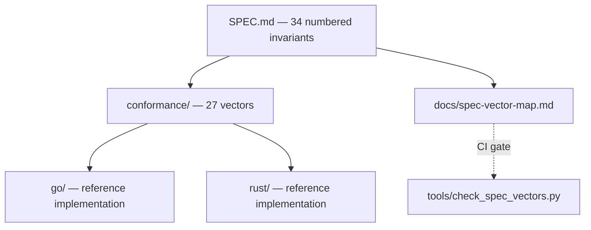

# Architecture Overview

This repository is a **specification repository**. Its primary artifact is a
document, not a binary: [`SPEC.md`](../../SPEC.md) defines the CIC object
model, and everything else here exists to keep that document honest.

## The three layers

| Layer | Role |
|---|---|
| `SPEC.md` | The authority. Normative, RFC 2119 language, numbered invariants. |
| `conformance/` | The falsifiable part. YAML in, YAML out — implementation-independent. |
| `go/`, `rust/` | Two subordinate implementations of the same document. |

## Why two implementations

A normative specification implemented once is not falsifiable: the
implementation silently becomes the specification and the document becomes
decoration. Implemented twice, every disagreement is evidence — where the two
differ, the specification was ambiguous.

This is why all four artifacts live in one repository. A semantic change
arrives as a single change (SPEC + vectors + Go + Rust), which makes it
physically awkward to alter one implementation's behaviour without the corpus
and the other implementation noticing.

## Why the vectors are implementation-independent

The corpus is plain YAML with no language-specific fixtures, so a third
implementation — Python, TypeScript, anything — costs nothing beyond the
implementation itself: implement the spec, run the corpus.

## The CI gates

| Gate | What it protects |
|---|---|
| `check_spec_vectors.py` | SPEC and the corpus cannot drift apart — no invariant may exist without a vector or a written justification for having none |
| `manifest-verify` | repository integrity (`MANIFEST.sha256`) |
| `docs.link-check` | internal documentation links resolve |
| `golang.quality` / `rust.quality` | per-implementation quality gates |
| `make conformance` | cross-implementation agreement; **fails rather than passing vacuously when no implementation is present** |

The last point is deliberate. A vector corpus that reports success with nothing
to run against would be worse than no corpus at all.

## Inherited machinery

The build system (Docker builder, `mk/`, Vault release signing, manifest
integrity) comes from `base-repo` `wasm/main`, with the WASM-specific parts
removed. See [`branch-decision.md`](../branch-decision.md) for the measurement
behind that choice.
